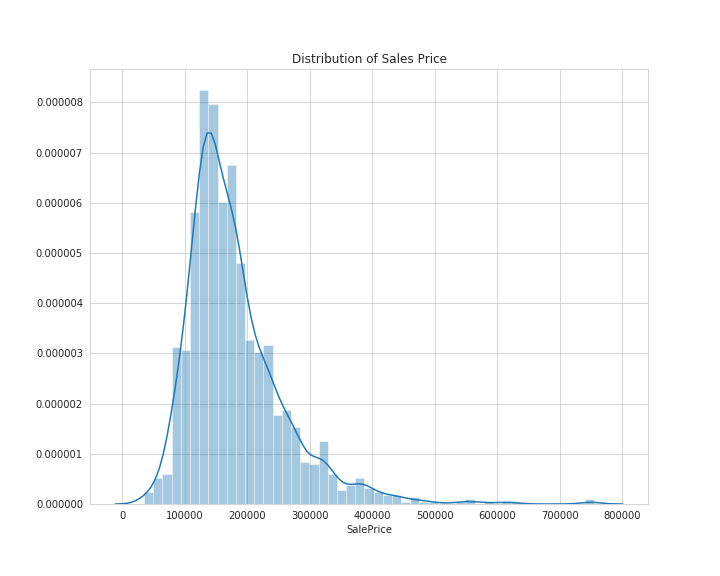
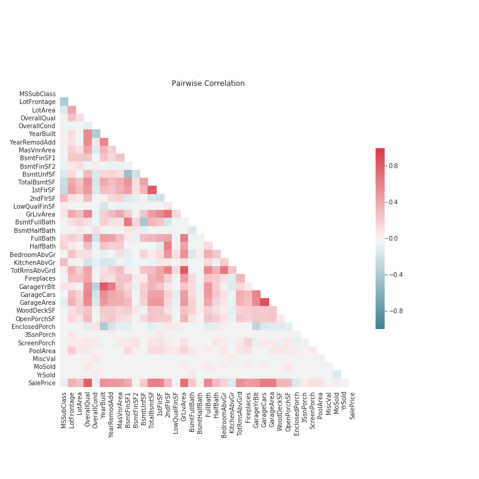
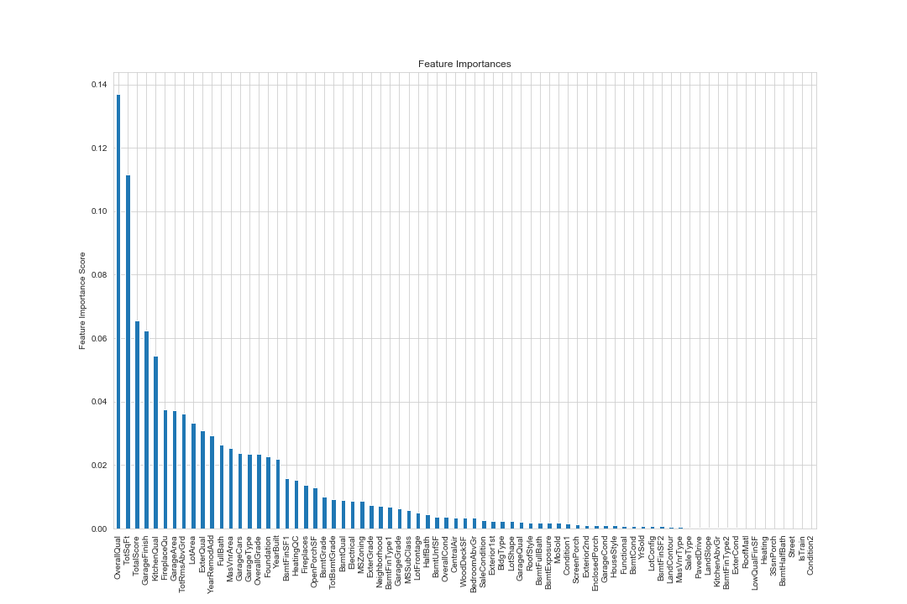
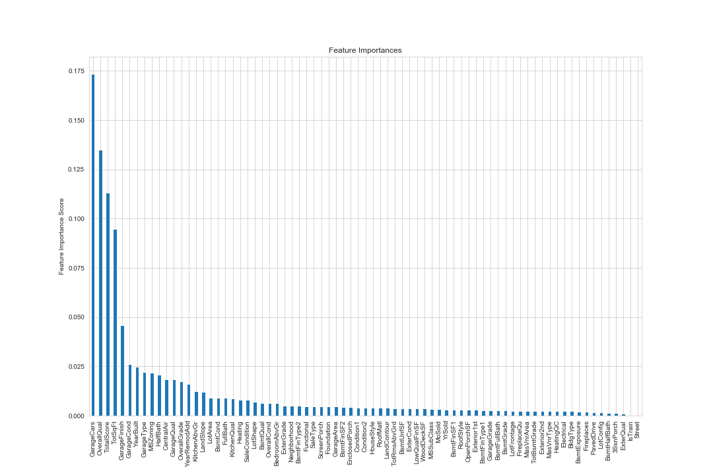

# Ames Housing Prices
This repo chronicles my work on the Ames housing price kaggle challenge. The goal of the challenge is to use various property data, including information on size, housing features, condition, etc. to predict the sale price of the property.
To this end I preformed a notable amount of exploratory analysis on the data before modeling for price.

## General Overview

### Exploratory Analysis
The first step I took in this project was general exploratory analysis of the data set. To this end I reviewed the distribution of the dependent variable, SalePrice, the distributions and interactions of the variables most highly correlated with SalePrice, and then generally reviewed the interaction of all variables with the SalePrice.

The sales prices are somewhat left-skewed, with a skew of 1.88 and a kurtosis of 6.54. An average house in Ames, Iowa costs approximately $180,000.

Although the strong correlations in the data set among all variables are of interest when it comes to modeling, those most interesting at the moment are the strong correlations between SalePrice and other variables.
The variables which are most strongly correlated with SalePrice are:
* OverallQual (The overall quality of the property)
* GrLivArea (The square footage of the above ground living area in the property)
* GarageCars (The capacity of the garage, measured in how many cars it can fit)
* GarageArea (The square footage of the garage)
* TotalBsmtSF (The total square footage of the basement)
* 1stFlrSF (The total square footage of the first floor)
* FullBath (The number of full bathrooms in the property)
* TotRmsAbvGrd (The total number of above ground rooms)
* YearBuilt (The year in which the property was built)
* YearRemodAdd (The year in which the property was most recently remodeled)

All of these variables were found to explain more than 50% of the variance in the sales prices. The interaction of all of these variables with the sale price is explored with greater depth in the `Exploratory Analysis - Main.ipynb` file. Additionally, as these variables also frequently were highly correlated with other variables, including those in the above list, these relationships are explored in the `Exploratory Analysis - Main.ipynb` file as well. Any variable found to be too highly correlated with another useful predictor was reviewed and, if necessary, dropped from the prediction set.

### Data Treatment and Feature Extraction/Creation
Before creating any models for the data, I first reviewed and treated all missing values, and created/extracted new features in order to improve future predictive accuracy. Finally, data was treated for skewing.

Before any feature was altered in the data, or any missing value treated, I created a copy of the response from the training set, `SalePrice`, called y_train, and then concatenated the training and test sets. To this end I created a boolean flag feature which marked the observations as being from the train or test sets: `IsTrain = 1 | 0`. This was done such that all categorical features would have similar levels, to allow for modeling and predicting on the sets, and to ensure that any created feature will exist similarly in the test set as in the training set. No features were extracted or created during this time which would provide the training set any information from the test set.

#### Missings
The majority of the missing values in the data set were due to the fact that the initial data was collected such that and NaN values reflected the absence of a given feature for a specific property (ie. If a property did not have a pool, the observation was marked as NaN). NaN values of this type are described fully in the data descriptive file: `data_description.txt`.

Any missing value which was found to not follow this pattern of "intentional" missing values were set using the mode of the data. This choice was made as there were so few actual missing values and, as such, no clear pattern could be discerned.

Any feature which had too large a percentage of its observations missing was dropped from the data sets.

#### Feature Extraction/Creation
In the process of feature extraction and creation I preformed two main methods:
+ I converted all "grading" features (ie. Exterior Condition, which was originally categorical with levels referring to the quality (Poor, Fair, Average/Typical, Good, Excellent)) to numeric levels to convey the ordering of the levels.
  - For this a lower number was used to signify a lower quality, while a higher number was used to signify a higher quality.
  - The 0 level was reserved in all cases to indicate the absence of a feature for a given observation.
+ Created grouped-graded features which marked the total quality of linked grading features.
  - An example of this is the combination of overall quality with overall condition resulting in an overall grade feature which grade the quality of the property as a whole (ie. `OverallQual + OverallCond = OverallGrade`)

#### Skewed features
In the original exploratory analysis file, the distribution of the numeric data was reviewed. Although the data appeared to be normal, it was clearly skewed with greater and lesser degrees, to the left. I reviewed the effects of two different transformations on the data - the Logistic transformation and the Box Cox transformation. I found that, for the prediction set,

### Modeling

In the process of modeling for the Sale Price of the properties, I utilized multiple different tactics to improve my score, including general "base" modeling, stacking, and met-models.

**Step 1**
The first of these was to create a set of "base" models, which performed different methods of regression to estimate the sale price. Included in the base models were both standard regression models (such as Lasso, Elasticnet, and Ridge) as well as ensemble models (such as random forest, gradient boosting and XGBoost). For the ensemble methods, I generated feature importance plots to better understand the weight of the features in the models.

  
  

Included in the top five most important features for both models are the variables:
+ OverallQual
+ TotalScore
+ TotSqFt
+ and, Garage Finish

After the base models were created, they were scored using 5-fold crossvalidation, with the mean of the 5 scores acting as the overall score for analysis. The models found to be the most accurate were, in descending order of accuracy,
+ Ridge
+ Elasticnet
+ Gradient Boosting (GBM)
+ and, Lasso

with the last three models differing in accuracy by no more than a hundredth of a percent.

**Step 2**
Building on the results of the first step, in the second step I stacked the models to create an averaged overall model, which would be used to increase the accuracy of the predictions beyond the capabilities of the individual base models. With the goal of increased accuracy in mind, only the most successful of the base models was considered for averaging.

A new class was created to handle the creation of the stacked models, which would create a group of models and then predict on all of them, averaging their predictions for the final prediction output.

**Step 3**
Continuing to build on the work of the last two steps, I culminated my work by creating a stacked averaged model which included the creation of a meta model, which uses the predictions of the base models as features to generate the final prediction output.

## Requirements
The requirements to run this analysis on your local machine are included in the `requirements.txt` file.
